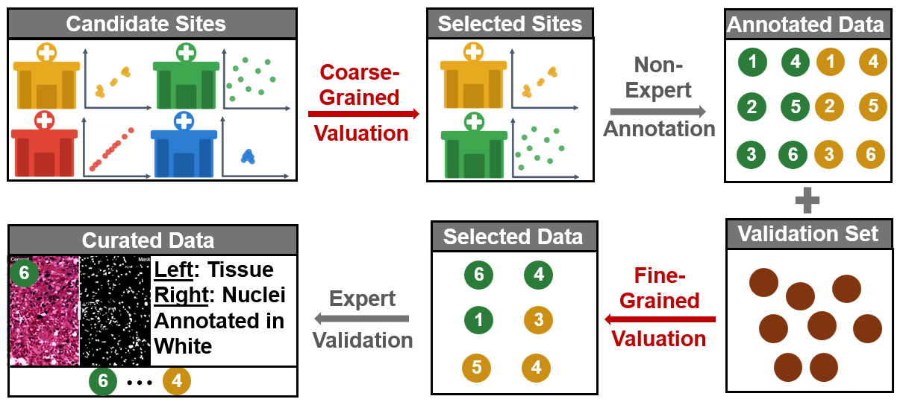

# Data Valuation

> This is the official code base for **"Data Valuation for Machine Learning: Experiments and Analyses [Experiment, Analysis & Benchmark]"**

Experimental benchmark for data valuation methods in machine learning, covering fine-grained and coarse-grained granularities across diverse datasets, tasks, and scales.

---
# Use Case

<p align="left">
  
</p>


## Repository Structure

```
data-valuation/
├── src/
│   ├── fine_grained/          # Fine-grained valuation
│   │   ├── __main__.py        # CLI entry point (Typer)
│   │   ├── dataloader/        # Dataset fetching, noise injection, registration
│   │   ├── dataval/           # Pointwise valuation methods (AME, DVRL, LAVA, ...)
│   │   ├── experiment/        # ExperimentMediator orchestration harness
│   │   └── model/             # Models
│   └── coarse_grained/        # Coarse-grained valuation
│       ├── baselines/         # OT, RVol, DAVINZ (NTK-MMD)
│       ├── models/            # CNN, ResNet, MLP
│       ├── scripts/           # MPerf correlation & robustness & sensitivity experiments
│       └── utilities/         # helpers
├── Scripts/                   # Full data valuation pipeline (Adult, CIFAR-10, HEP mass 1K–7M, ...)
├── Plots/                     # Experiment results
│   ├── fine_grained/          # Per-dataset evaluation plots (Adult, CIFAR-10, DogFish, ...)
│   │   └── (tuning inside)    # parameter tuning results per dataset
│   └── Scalability/           # Scalability results for fine- and coarse-grained methods
├── data/                      # Datasets for reproducibility
├── requirements.txt
└── setup.py
```

## Setup

### Quick Install (Automated)
```bash
bash src/fine_grained/setup.sh
```

### Manual Install
```bash
# Clone repository
git clone https://github.com/validal/data-valuation.git
cd data-valuation

# Create Python 3.12 virtual environment
python3.12 -m venv finegrained_valuation
source finegrained_valuation/bin/activate  # Linux/Mac
# Or: finegrained_valuation\Scripts\activate  # Windows

# Install PyPI requirements
pip install -r requirements.txt

# Clone and install GhostSuite
git clone https://github.com/Jiachen-T-Wang/GhostSuite.git
pip install -e GhostSuite --no-deps

# Install modified opendataval
pip install -e src/fine_grained/opendataval
```

---

## Running Experiments

### Fine-grained Data Valuation

**HEPMass Variants (1K to 7M samples):**
```bash
python Scripts/run_hep1k_dataval.py
python Scripts/run_hep10k_dataval.py
python Scripts/run_hep100k_dataval.py
python Scripts/run_hep1m_dataval.py
python Scripts/run_hep7m_dataval.py
```

**CIFAR-10 with Different ResNets:**
```bash
python Scripts/run_cifar10_resnet9_dataval.py --method DOOB
python Scripts/run_cifar10_resnet18_dataval.py --method LoGRA
python Scripts/run_cifar10_resnet50_dataval.py --method InRunDataShapleyGhost
python Scripts/run_cifar10_resnet152_dataval.py --method KairosGPU
```

**Other Datasets:**
```bash
python Scripts/run_adult_dataval.py --method DataOob
python Scripts/run_connect4_dataval.py --method KNNShapley
python Scripts/run_dogfish_dataval.py --method LAVA
python Scripts/run_cifar10_base_dataval.py --method Random
```

### Fine-grained CLI
```bash
python -m src.fine_grained --help
```

### Coarse-grained Experiments
```bash
python src/coarse_grained/scripts/boostrap.py
python src/coarse_grained/scripts/robustness.py
```

---

## Running Experiments

```bash
# Fine-grained CLI
python -m src.fine_grained --help

# Fine-grained scripts
python Scripts/run_adult_dataval.py --method DataOob 
python Scripts/run_cifar10_dataval.py --method KNNShapley 
python Scripts/run_hepmass_dataval_100k.py --method LAVA 

# Coarse-grained scripts
python src/coarse_grained/scripts/boostrap.py 
python src/coarse_grained/scripts/robustness.py
```

---

## Results

All plots and figures are stored in `Plots/`, organized by granularity and experiment type:
- **`Plots/fine_grained/`** — per-dataset evaluation and tuning results (Figures 4-5-6-7-8)
- **`Plots/Scalability/`** — runtime and performance scaling (Figure 9)

---

## Acknowledgements

This project builds upon several open-source works. We thank the authors of:
- [OpenDataVal](https://github.com/opendatval/opendatval)
- [LAVA](https://github.com/reds-lab/LAVA/)
- [SAVA](https://github.com/skezle/sava)
- [DAVINZ](https://github.com/ZhaoxuanWu/DAVINZ-DataValuation)
- [KNN-PVLDB](https://github.com/AI-secure/KNN-PVLDB)
- [KAIROS](https://github.com/lodino/kairos)
- [GhostSuite](https://github.com/Jiachen-T-Wang/GhostSuite) — Data Shapley in One Training Run
- [LogIX](https://github.com/logix-project/logix) — LoGRA method

for making their implementations publicly available.

---

## License

MIT © 2026 validal
